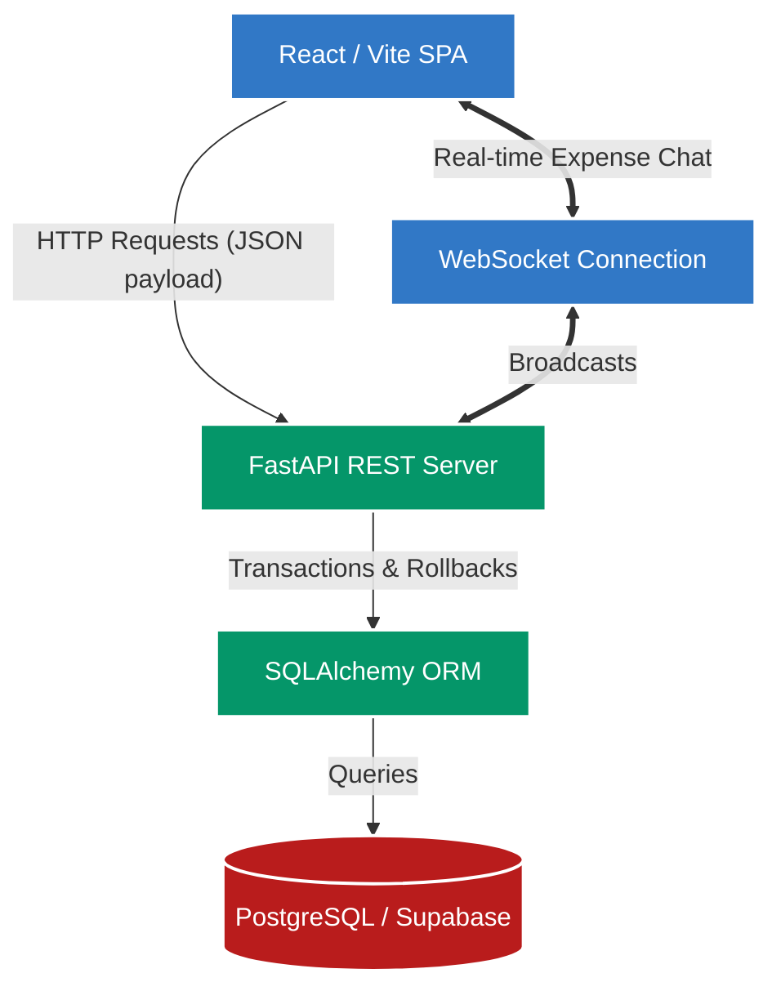

# Splitwise Clone: Technical Design Document

A production-grade, full-stack expense sharing application built to solve the complex mathematical and architectural challenges of group debt simplification. This project demonstrates advanced system design, strict financial integrity, and real-time bidirectional communication.

## 🚀 System Architecture



### Architectural Highlights
1. **Financial Precision (The "Penny Problem"):** Floating-point math causes decimal inaccuracies. The backend engine resolves this by converting all floating amounts into integer-cents before performing exact modulo math, gracefully distributing any remainder to ensure the ledger perfectly balances.
2. **Greedy Graph Debt Simplification:** The system uses a two-pointer matching algorithm to dynamically collapse the debt graph, returning the absolute minimum number of cash transfers required to zero-out the entire group.
3. **Transaction Safety:** All financial actions (creating an expense, calculating exact splits, updating the balance cache) are wrapped in strict ACID `db.commit()` and `db.rollback()` blocks.

---

## 🛠️ Evaluator Testing Guide

To make grading and testing this assignment as frictionless as possible, a custom testing tool has been built directly into the UI.

### The "Fast-Switch User" Tool
Testing an expense-sharing app usually involves a tedious cycle of logging out and logging back in to see the app from different users' perspectives (e.g., *User A creates an expense -> log out -> log in as User B -> check dashboard -> pay User A*).

**How to test rapidly:**
Look at the global Navigation bar at the top of the screen. You will see a dropdown labeled **Profile: [Name]**. 
You can click this dropdown from *any page* (even deep inside an expense detail view) to instantly masquerade as any user in the system. The page will immediately re-render to show that specific user's debts, permissions, and view. No passwords or logouts required!

---

## 💻 Local Development Setup

Follow these exact steps to run the application locally from scratch on a blank database.

### 1. Backend Setup
```bash
# Navigate to the backend directory
cd backend

# Create and activate a virtual environment
python -m venv venv
# On Windows: .\venv\Scripts\Activate.ps1
# On Mac/Linux: source venv/bin/activate

# Install dependencies
pip install -r requirements.txt

# Run Alembic migrations to build the empty database schema
alembic upgrade head

# (Optional) Seed the database with manual test data
# Note: Evaluators should skip this to experience a fresh database
python seed.py

# Start the FastAPI Server on port 8000
uvicorn main:app --reload
```

### 2. Frontend Setup
```bash
# Open a new terminal and navigate to the frontend directory
cd frontend

# Install dependencies
npm install

# Start the Vite React Server
npm run dev
```

## 🌍 Production Deployment

This application is fully compatible with serverless cloud infrastructure:
1. **Database:** PostgreSQL hosted via Supabase.
2. **Backend:** FastAPI Web Service hosted on Render.
3. **Frontend:** React SPA hosted globally on Vercel.
