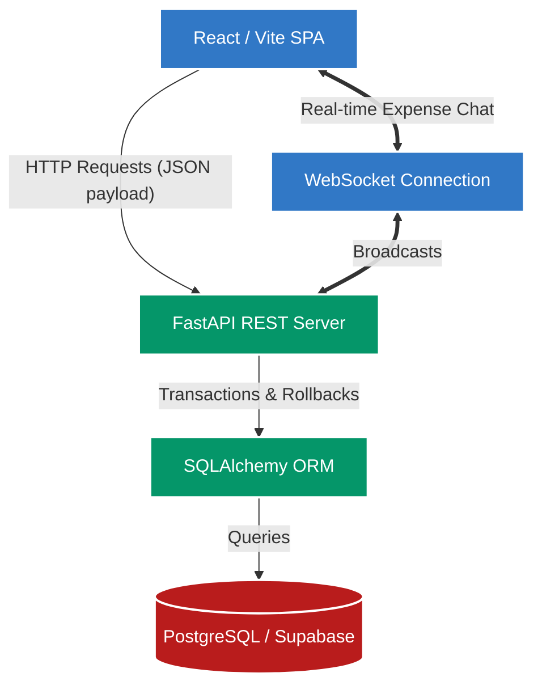

# Splitwise Clone: Technical Design Document

## 🚀 Project Overview

This repository contains a production-grade, full-stack expense sharing application designed to solve the complex mathematical and architectural challenges of group debt simplification. The application is a fully functional Splitwise clone featuring a React frontend, a FastAPI backend, and a PostgreSQL database. It demonstrates advanced system design, strict financial integrity with integer-cents accuracy, and real-time bidirectional communication.

## 🏗️ System Architecture Flowchart



## 🛠️ Evaluator Testing Guide

To make grading and testing this assignment as frictionless as possible, a custom testing tool has been built directly into the UI.

### The "Fast-Switch User" God Mode
Testing an expense-sharing app usually involves a tedious cycle of logging out and logging back in to see the app from different users' perspectives (e.g., *User A creates an expense -> log out -> log in as User B -> check dashboard -> pay User A*).

**How to test rapidly:**
Look at the global Navigation bar at the top of the screen. You will see a dropdown labeled **Profile: [Name]**. 
You can click this dropdown from *any page* (even deep inside an expense detail view) to instantly masquerade as any user in the system. The page will immediately re-render to show that specific user's debts, permissions, and view. No passwords or logouts required! This tool allows you to easily jump between user profiles to test group debt simplification without logging in and out.

## 💻 Local Setup Instructions

Follow these exact steps to run the application locally from scratch on a blank database.

### 1. Backend Setup
```bash
# Navigate to the backend directory
cd backend

# Create and activate a virtual environment
python -m venv venv
# On Windows: .\venv\Scripts\Activate.ps1
# On Mac/Linux: source venv/bin/activate

# Install dependencies
pip install -r requirements.txt

# Run Alembic migrations to build the empty database schema
alembic upgrade head

# Start the FastAPI Server on port 8000
uvicorn main:app --reload
```

### 2. Frontend Setup
```bash
# Open a new terminal and navigate to the frontend directory
cd frontend

# Install dependencies
npm install

# Start the Vite React Server
npm run dev
```

> **Note on Seeding Data:** The application does not automatically seed the database on startup. Evaluators will experience a completely fresh, empty database when they first load the app. If manual test data is desired, you can explicitly run `python seed.py` in the backend directory.
